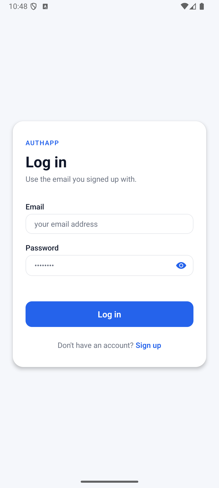
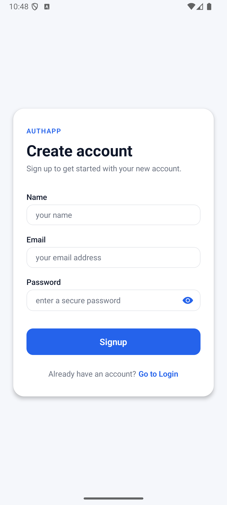
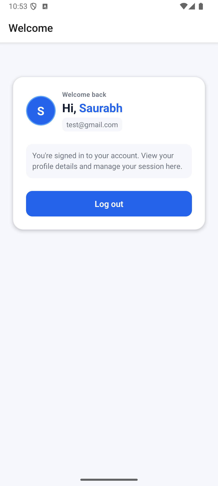
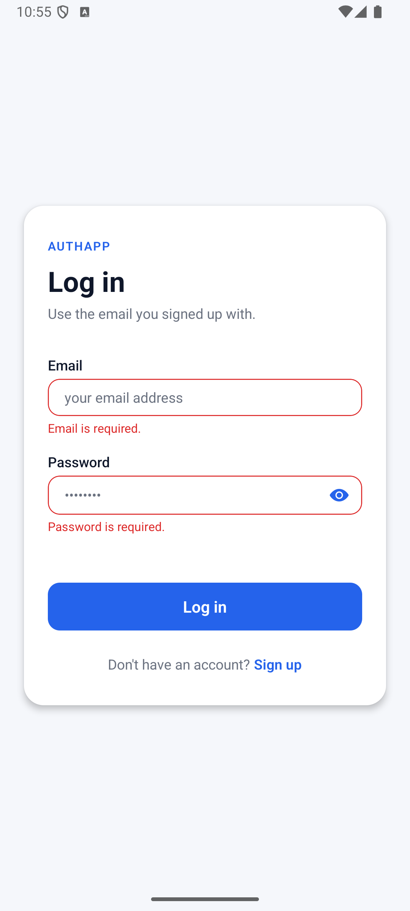
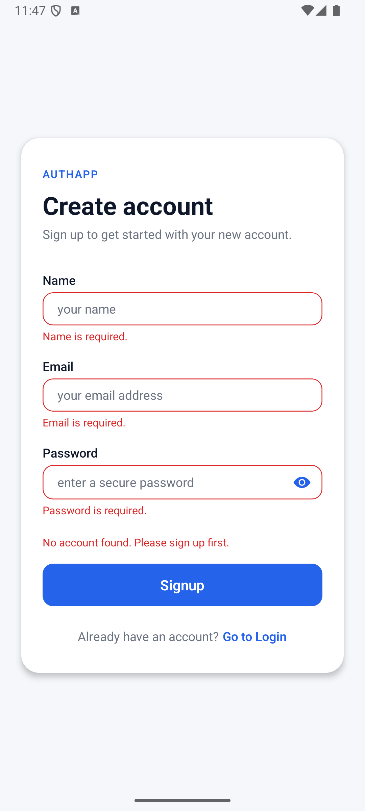

# AuthAppDemo

## Authentication features

- **Login Screen**
  - Email and password fields with validation.
  - Error messages for invalid email format and incorrect credentials.
  - Navigation to the Signup screen.

- **Signup Screen**
  - Name, email, and password fields with validation:
    - All fields required.
    - Email must be valid.
    - Password must be at least 6 characters.
  - Error messages for missing/invalid fields.
  - Navigation back to the Login screen.

- **Home Screen**
  - Displays the logged-in user&apos;s name and email.
  - Logout button to clear auth state and return to Login.

- **Auth State Management**
  - Uses React Context (`AuthContext`) to store `user`, errors, and auth actions.
  - `login`, `signup`, and `logout` functions exposed via context.
  - Optional persistence via `AsyncStorage` so the user can remain logged in between app launches.


## Running the app

Follow the Getting Started steps above:
1. Clone the repository
```sh
git clone https://github.com/Saurabh123kandari/AuthAppDemo.git
```
```sh
cd AuthApp
```
1. Install dependencies:

```sh
npm install
```

2. Start Metro:

```sh
npm start
```

3. Run on a device or emulator:

```sh
# Android
npm run android
```
```sh
# iOS
npm run ios
```

<div align="center">

## Screenshots

### Login Screen


### Signup Screen


### Home Screen


### Login Validation Screen


### Signup Validation Screen


</div>

## Demo Video

Watch the demo here:

https://drive.google.com/file/d/1aNQSBqmh7q0sKAfVyvobstnTE89aUeKU/view?usp=sharing